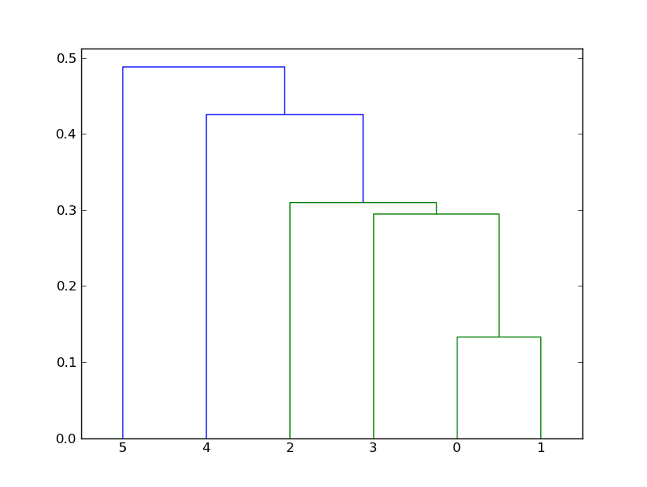

## Clustering Homework

*Alireza Nourian*
 

1.a) Each point is part of first or second cluster, so we've got 2**5. But there are two situations with one cluster that must be removed. And there is no difference between clusters, so we divide result by 2:
	
	(2**5 - 2)/2 = 15

2.

+ *center-based*

	
	
	

+ *contiguous*

	
	
	

+ *density*

	
	
	

3.a)

b)

c)

d)

4.

+ single linkage (min):
	

+ complete linkage (max):
	

5.a)
	
	i.
		18: [ 6 12 18 24 30], SSE = 360, mean = 18.0
		45: [42 48], SSE = 18, mean = 45.0
	ii.
		15: [ 6 12 18 24], SSE = 180, mean = 15.0
		40: [30 42 48], SSE = 168, mean = 40.0

b) Mean of each clusters equals to it's center, so these are the stable ones.

c)

	[6, 12, 18, 24, 30], [42, 48]

d)	the **MIN** one

7.

+	a) D
+	b) C
+	c) A
+	d) B

8.

	entropy = -0.991773114378
	purity = 0.811594202899