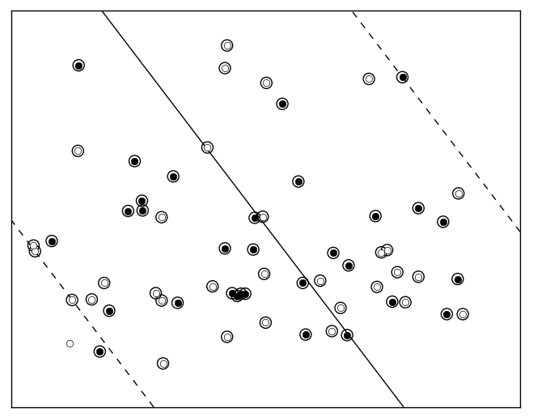
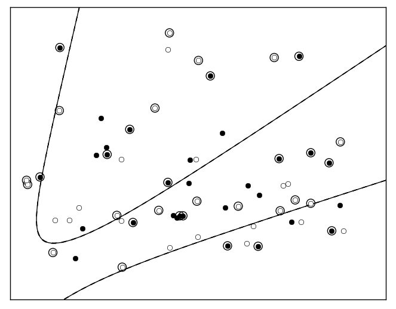
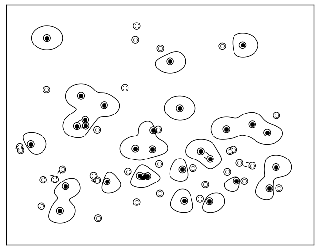

## SVM Homework

*Alireza Nourian*
 

I selected first three classifiers:

+ Simple (No Kernel, C = 5)
+ Polynomial (Order 3)
+ RBF (Sigma = 0.1)

I implemented this homework with *python* using *scikit-learn* package.

a)

+ *Linear:*

+ *Polynomial:*

+ *RBF:*

b)

*Linear:*

	support vectors = 55
	precision = 0.50
	recall = 1.00
	confusion matrix:
		N	P
	N	1	3
	P	0	3

*Polynomial:*

	support vectors = 29
	precision = 0.50
	recall = 0.25
	confusion matrix:
		N	P
	N	2	1
	P	3	1

*RBF:*

	support vectors = 55
	precision = 0.75
	recall = 0.75
	confusion matrix:
		N	P
	N	2	1
	P	1	3

c)

*ensemble:*

	precision = 0.80
	recall = 1.00
	confusion matrix:
		N	P
	N	2	1
	P	0	4
